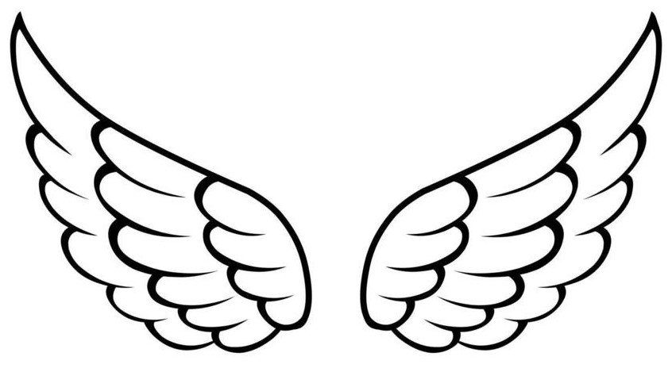

<!DOCTYPE html>
<html lang="pl">
    <head>
        <meta charset="UTF-8">
        <title>Good Omens</title>
        <link rel="stylesheet" href="style.css">
        <link rel="stylesheet" href="css/fontello.css">
        <link href="https://fonts.googleapis.com/css2?family=Lato:wght@100;400;700&display=swap" rel="stylesheet">
        <link rel="shortcut icon" href="go-title.jpg">
    </head>
    <body>
        

                 

                    
                    GOOD OMENS
                    
                 

            <main class="opis">
                <h1>Page description</h1>
                

                    
[Good Omens](GO.html)

                

            </main>
            <footer>
                &copy; Wszelkie prawa zastrzeżone
            </footer>
        
  
    </body>
</html>
